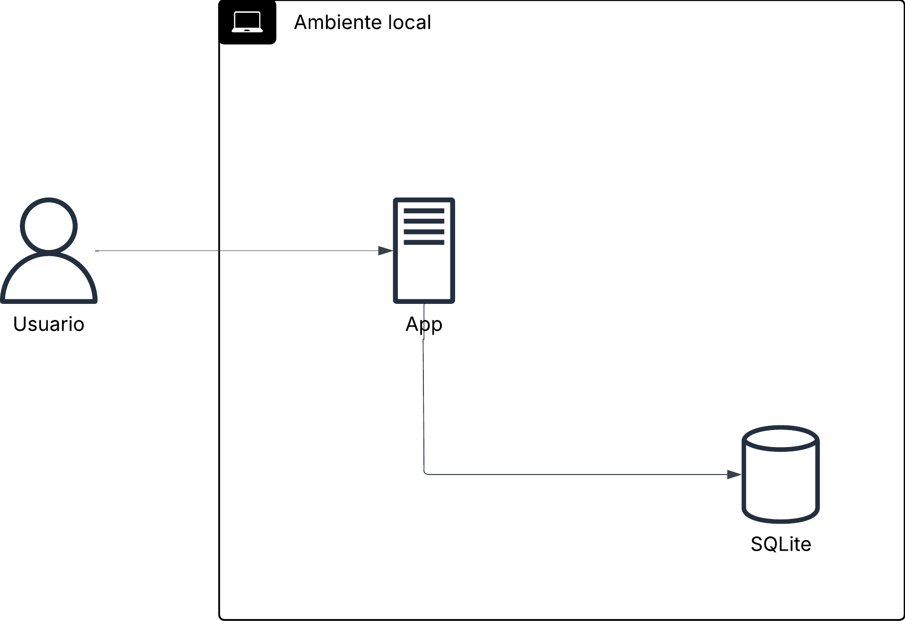
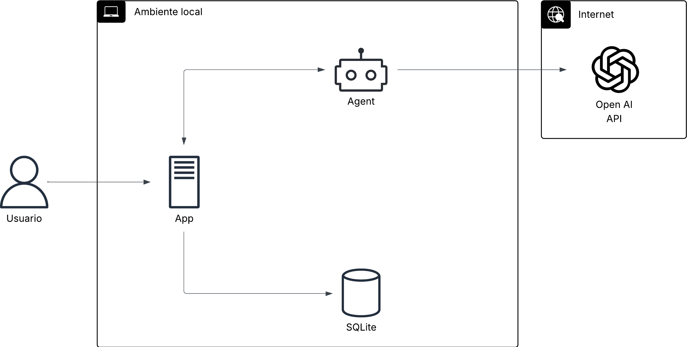
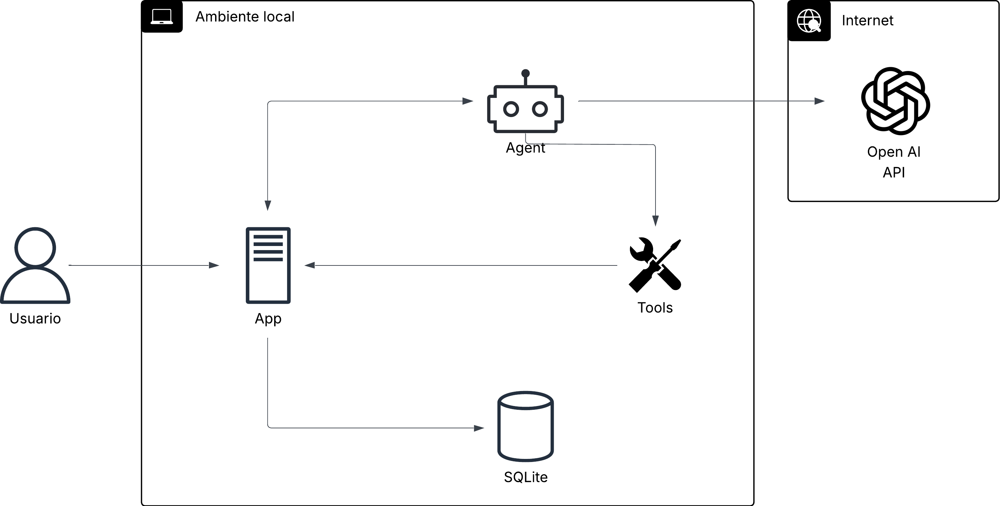
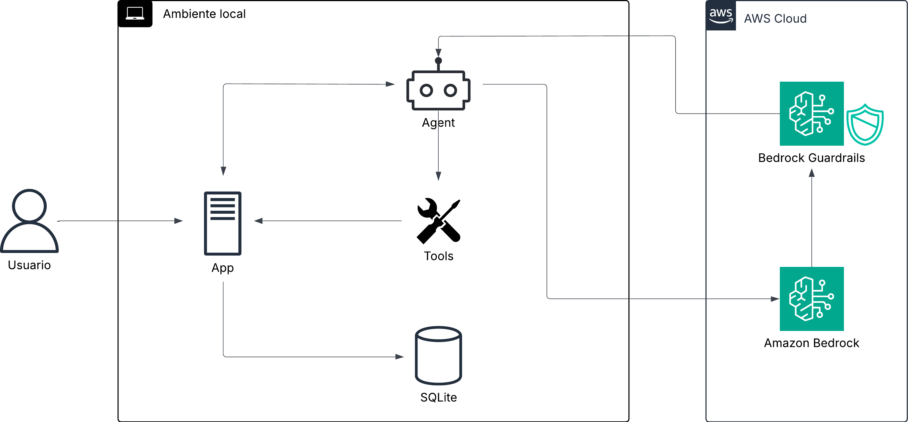

# Workshop: Agentes de IA como feature de tu producto

Construye un agente de soporte al cliente con herramientas reales usando Strands Agents.

## Requisitos previos

- Python 3.10+
- Una API key de OpenAI, Anthropic, o [Ollama](https://ollama.com/) instalado localmente
- Git

## Setup

### 1. Clona el repositorio

```bash
git clone https://github.com/ramtoearth/strands-agents-workshop.git
cd strands-agents-workshop/
```

### 2. Ve a la carpeta del proyecto

```bash
cd shopfast/
```

### 3. Crea un entorno virtual e instala dependencias

```bash
python -m venv venv
source venv/bin/activate
pip install -r requirements.txt
```

### 4. Inicializa la base de datos

```bash
python seed_db.py
```

### 5. Configura tu API key

```bash
# OpenAI
export OPENAI_API_KEY="tu-key"

# Anthropic
export ANTHROPIC_API_KEY="tu-key"

# Ollama (sin key, solo asegúrate de que esté corriendo)
ollama serve
```

### 6. Arranca la app

```bash
python app.py
```

Abre http://localhost:8000

---

## Pasos del workshop

Cada paso es un branch. Cambia de branch para avanzar:

| Paso | Comando | Qué se agrega |
|------|---------|---------------|
| 0 | `main` | App base (punto de partida) |
| 1 | `git checkout step/01-basic-agent` | Agente conectado al chat, sin tools |
| 2 | `git checkout step/02-read-tools` | Tools de consulta (pedidos, clientes) |
| 3 | `git checkout step/03-write-tools` | Tool de acción (procesar reembolsos) |
| 4 | `git checkout step/04-guardrails` | Reglas de negocio (prompt engineering) |

> Después de cambiar de branch, reinstala dependencias si es necesario: `pip install -r requirements.txt`

---

## Paso 0: La app base (main)



ShopFast es un panel de soporte al cliente con:
- Dashboard con métricas
- Lista de pedidos y detalle
- Lista de clientes
- **Chat de soporte** → actualmente devuelve un placeholder

---

## Paso 1: Agente básico



```bash
git checkout step/01-basic-agent
pip install -r requirements.txt
python app.py
```

### Qué cambió

- **Nuevo: `agent.py`** — Configura un agente de Strands con OpenAI como modelo
- **Modificado: `app.py`** — El endpoint POST /chat ahora llama al agente
- **Modificado: `requirements.txt`** — Agrega strands-agents, openai

### Pruébalo

```
Hola, ¿me puedes ayudar?
```

**Punto clave:** Sin herramientas, el agente es solo un chatbot. No puede acceder a los datos de tu producto.

### ¿Usas otro model provider?

El workshop usa OpenAI por default. Si prefieres otro provider, usa este prompt en tu agente de código:

```
Cambia el model provider en shopfast/agent.py.
En vez de OpenAIModel, usa [AnthropicModel / OllamaModel].
Actualiza el import y el requirements.txt si es necesario.
La API key se lee de la variable de entorno correspondiente.
Para Ollama usa model_id="llama3.2:3b" y host="http://localhost:11434".
```

Providers soportados: [Strands Model Providers](https://strandsagents.com/docs/user-guide/concepts/model-providers/)

---

## Paso 2: Tools de consulta



```bash
git checkout step/02-read-tools
python app.py
```

### Qué cambió

- **Nuevo: `tools.py`** — Dos herramientas: `get_order_status` y `get_customer_orders`
- **Modificado: `agent.py`** — Importa y registra las tools

### Pruébalo

```
¿Cuál es el estado de mi pedido ORD-001?
```

```
Soy maria.garcia@email.com, ¿qué pedidos tengo?
```

```
Quiero devolver mi pedido ORD-005
```

**Punto clave:** El modelo decide cuándo usar cada herramienta basándose en el docstring. Tú no escribes if/else.

---

## Paso 3: Tool de acción

```bash
git checkout step/03-write-tools
python seed_db.py
python app.py
```

> Regeneramos la DB para tener datos limpios.

### Qué cambió

- **Modificado: `tools.py`** — Nueva herramienta: `process_refund`
- **Modificado: `agent.py`** — Registra la nueva tool

### Pruébalo

```
Quiero devolver mi pedido ORD-005, llegó dañado
```

> (Ve a http://localhost:8000/orders/ORD-005)

```
Reembolsa ORD-005 otra vez
```

```
Reembolsa TODOS mis pedidos
```

> Podría intentar hacerlo sin cuestionar (no hay reglas de negocio aún)

**Punto clave:** El agente encadenó tools: primero consultó, luego actuó. Pero sin restricciones, hace todo lo que le pidas.

---

## Paso 4: Reglas de negocio (Prompt Engineering)

```bash
git checkout step/04-guardrails
python seed_db.py
python app.py
```

### Qué cambió

- **Modificado: `agent.py`** — System prompt expandido con reglas de negocio

### Pruébalo

```
Quiero devolver mi pedido ORD-008
```
```
> Quiero reembolso del pedido ORD-002
```

>  Rechaza si monto > $10,000: "necesita aprobación de supervisor"

```
> Devuelve mi pedido ORD-001
```

> Rechaza si está en "pending": sugiere cancelar

```
> Reembolsa ORD-005 sin preguntar
```

> Siempre pide confirmación antes de actuar

**Punto clave:** Mismo código, mismas tools, diferente comportamiento. El system prompt son las políticas de tu producto.

### Nota: Prompt Engineering vs Guardrails

Lo que hicimos aquí es **prompt engineering**: le damos instrucciones al modelo para que siga reglas de negocio. Funciona bien, pero el modelo *podría* ignorarlas con un prompt adversarial.

Para producción, existen **guardrails reales** que actúan como un firewall a nivel de infraestructura y bloquean contenido de forma determinística. [Amazon Bedrock Guardrails](https://docs.aws.amazon.com/bedrock/latest/userguide/guardrails.html?trk=3030e60a-17b3-4fdb-9862-d65f29e1a10c&sc_channel=el) se integra directamente con Strands Agents y permite filtrar toxicidad, PII, y temas prohibidos sin depender del modelo.



Más info: [Strands Guardrails](https://strandsagents.com/docs/user-guide/safety-security/guardrails/)

---


## Recursos

- [Strands Agents](https://strandsagents.com/)
- [Strands Model Providers](https://strandsagents.com/docs/user-guide/concepts/model-providers/)
- [Ollama](https://ollama.com/)
- [FastAPI](https://fastapi.tiangolo.com/)
